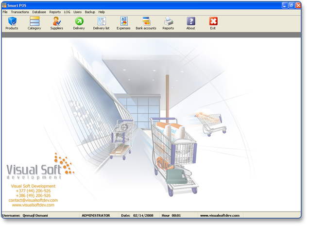



## Smart POS\(Point of Sales\)

### Description

See the project for much details !
 
### More Info
 

             |
---                |---
**Submitted On**   |2007-10-02 22:23:06
**By**             |[Visual Soft Computers](https://github.com/Planet-Source-Code/PSCIndex/blob/master/ByAuthor/visual-soft-computers.md)
**Level**          |Advanced
**User Rating**    |4.8 (111 globes from 23 users)
**Compatibility**  |VB 6\.0
**Category**       |[Databases/ Data Access/ DAO/ ADO](https://github.com/Planet-Source-Code/PSCIndex/blob/master/ByCategory/databases-data-access-dao-ado__1-6.md)
**World**          |[Visual Basic](https://github.com/Planet-Source-Code/PSCIndex/blob/master/ByWorld/visual-basic.md)
**Archive File**   |[Smart\_POS\(2101682132008\.zip](https://github.com/Planet-Source-Code/visual-soft-computers-smart-pos-point-of-sales__1-70092/archive/master.zip)

### API Declarations

Conctl32 controls

